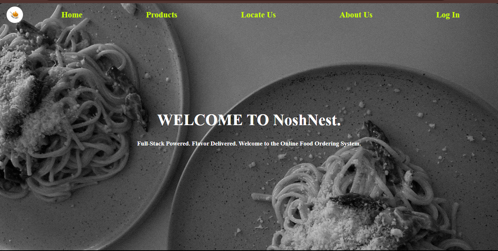
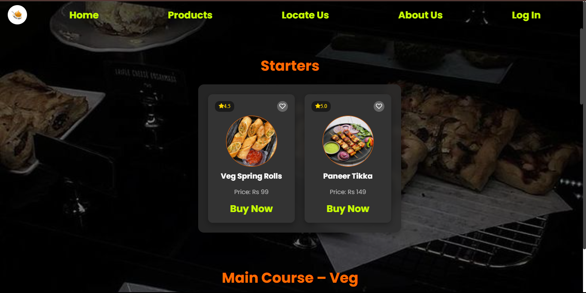
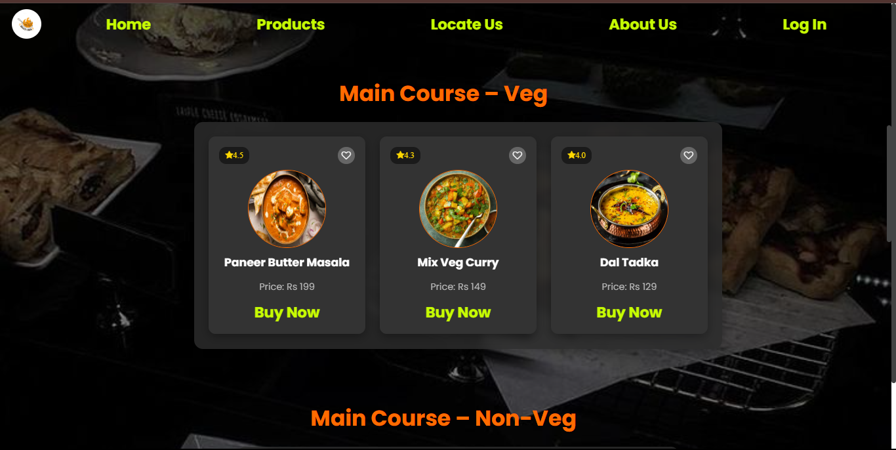
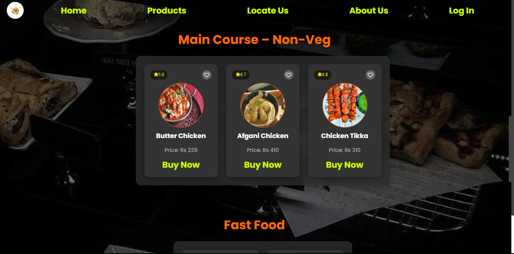
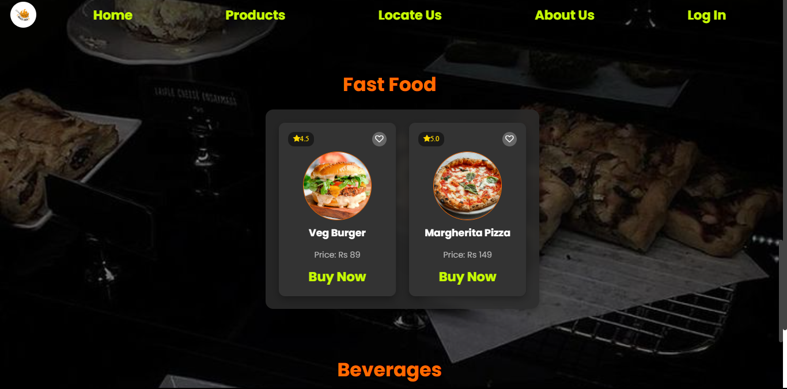
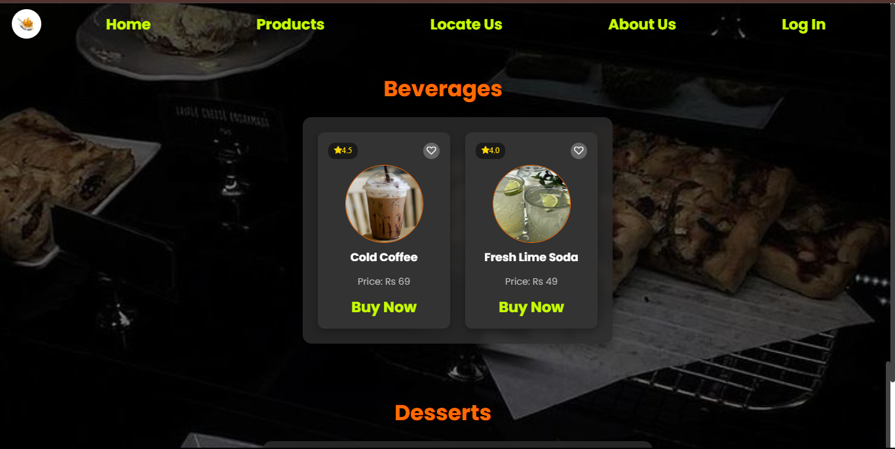
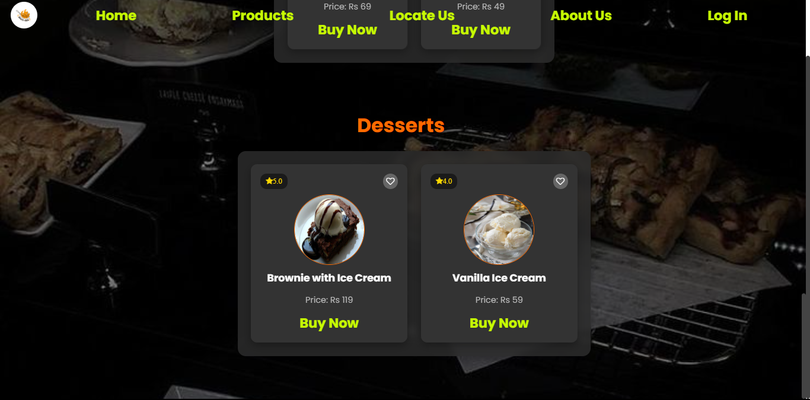

# 🍽️ NoshNest – Online Food Ordering System

**NoshNest** is a modern, responsive, and user-friendly online food ordering system designed to streamline food selection and order placement. Built with a Java backend and styled using HTML, CSS, and JavaScript, it provides an interactive experience with categorized menu sections and smooth UI elements.

---

## 🚀 Features

- ✅ **Categorized Menu** – Starters, Main Course (Veg/Non-Veg), Fast Food, Beverages, Desserts
- 🎨 **Dark-Themed Interface** – Stylish and modern dark UI with gradient buttons and hover effects
- 🖱️ **Interactive Design** – Popup confirmation boxes and responsive layout
- 💻 **Java Backend** – Handles user inputs, order processing, and logic
- 📱 **Mobile-Responsive** – Adapts well across screen sizes

---

## 🛠️ Tech Stack

| Layer       | Technologies                             |
|-------------|------------------------------------------|
| Frontend    | HTML5, CSS3, JavaScript                  |
| Backend     | Java (Core Java, Spring Boot, Swing)     |
| UI/UX       | Flexbox, Grid, Responsive Design         |

---

## 📸 Screenshots

> Replace these paths with actual uploaded images in a `screenshots/` folder.

### 🏠 Homepage

### 🍽️ Menu Layout
 
  
  
  
  
  

### 🗺️ Locate Us
Displays an interactive map section allowing users to find restaurant location.

### ℹ️ About Us
Overview of the platform's mission and story.

### ✅ Order Confirmation

---

## 📂 Folder Structure

NoshNest/  
│  
├── index.html # Frontend markup  
├── style.css # Custom styling  
├── script.js # Interactivity logic  
├── /backend # Java backend files  
├── /screenshots # App UI screenshots  
└── README.md # Project details  
